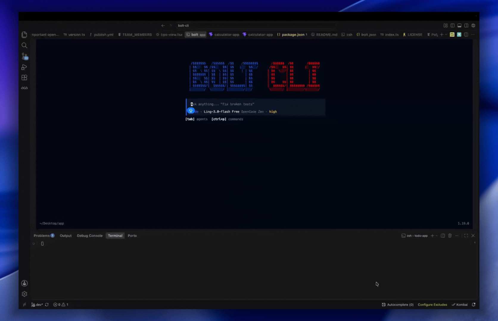

<p align="center">
  <a href="https://github.com/Bolt-builder/bolt-cli">
    
  </a>
</p>

<p align="center">Your terminal, now with a full AI engineering team inside it.</p>

<p align="center">
  <a href="https://github.com/Bolt-builder/bolt-clil"></a>
  <a href="https://www.npmjs.com/package/@bolt-builder/bolt-cli"></a>
  <a href="https://github.com/Bolt-builder/bolt-cli"></a>
  <a href="LICENSE"></a>
</p>
<p align="center">
  <a href="https://www.producthunt.com/products/bolt-cli?embed=true&utm_source=badge-featured&utm_medium=badge&utm_campaign=badge-bolt-cli" target="_blank" rel="noopener noreferrer"></a>
</p>

<p align="center">

</img>
</p>

<p align="center">
  💬 Questions, ideas, or just want to say hi? <a href="https://github.com/Bolt-builder/bolt-cli/discussions">Join the Discussions</a>
</p>

---

## Why Bolt?

Bolt reads your codebase, understands what you're building, and ships code with you: in the terminal, and as a desktop app.

- **Terminal-first.** A fast, keyboard-driven TUI built with [Effect](https://effect.website), [OpenTUI](https://github.com/opentui/opentui), and [SolidJS](https://www.solidjs.com).
- **A whole team of agents.** Ten specialized agents (code, plan, ask, review, debug, refactor, docs, security, migrate, perf) plus subagents for research and multi-step tasks.
- **Sessions you can leave and re-join.** Detach, attach (even to a remote server), fork, share, export, and import your work at any time.
- **Extensible by design.** MCP servers with OAuth, plugins, GitHub integration, and a built-in API server and web UI.
- **Desktop app.** The same engine wrapped in a multi-window desktop experience with tabs, an integrated terminal, and auto-updates.

## Get started in 30 seconds

```bash
# Quick install (macOS / Linux)
curl -fsSL https://raw.githubusercontent.com/bolt-builder/bolt-cli/dev/install | bash

# Or with npm / bun / pnpm / yarn
npm i -g @bolt-builder/bolt-cli

# Or with Homebrew (macOS / Linux)
brew install bolt-builder/tap/bolt-cli

# Or try it without installing
npx @bolt-builder/bolt-cli
```

Then, from any project:

```bash
# Open the TUI in the current directory
bolt

# Run a prompt directly (non-interactive)
bolt run "explain this codebase"

# Attach to a running server (local or remote)
bolt attach <url>

# Start a session with a specific agent
bolt run --agent ask "what does this project do?"
```

That's it. Bolt picks up your project context automatically.

## Agents

Built-in agents. Switch with `Tab` in the TUI.

| Agent          | Access | Description                                                              |
| -------------- | ------ | ------------------------------------------------------------------------ |
| `orchestrator` | Full   | Coordinates complex multi-step tasks by delegating to specialized agents |
| `code`         | Full   | Default: reads, writes, runs code                                        |
| `plan`         | Read   | Explores and produces a plan without changing code                       |
| `ask`          | Read   | Questions and research, no file edits                                    |
| `code-review`  | Read   | Reviews changes for correctness, style, and security                     |
| `debug`        | Full   | Debugs failing tests, crashes, and logic errors                          |
| `refactor`     | Full   | Safe refactoring with test verification at each step                     |
| `docs`         | Edit   | Writes and updates documentation and comments                            |
| `security`     | Read   | Security audit: vulnerabilities, secrets, patterns                       |
| `migrate`      | Full   | Framework upgrades and dependency migrations                             |
| `perf`         | Full   | Performance analysis and optimization                                    |

Subagents for delegation: `@general` for complex multi-step tasks and `@explore` for fast read-only codebase research. You can also define your own agents as markdown files or generate one with `bolt agent create`.

## Power features

- **Remote sessions**: `bolt attach <url>` and `bolt run --attach <url>` work against any running server, with basic auth and mDNS discovery (`serve --mdns`).
- **Fork and share**: branch a session with `--fork`, share with `run --share`, import straight from a share URL with `bolt import <url>`, export sanitized transcripts with `export --sanitize`.
- **Model control**: pick reasoning effort with `run --variant`, show reasoning with `--thinking`, stream raw events with `--format json`.
- **MCP with OAuth**: `bolt mcp add/auth/logout/debug` manages servers end to end, including OAuth flows and connectivity probes.
- **Minimal mode**: `--mini` gives a compact interactive UI on `bolt`, `run`, and `attach`.
- **Local data, inspectable**: your sessions live in sqlite; query them with `bolt db` any time.

## Desktop app

Bolt also ships as a desktop app: multi-window and multi-tab session management, a prompt composer with attachments and clipboard image paste, an integrated terminal and file tree, a command palette, full settings (keybinds, models, providers, servers), native notifications, deep links, WSL integration on Windows, auto-updates across dev/beta/prod channels, and 17 UI languages. Download it from the [releases page](https://github.com/Bolt-builder/bolt-cli/releases).

> [!TIP]
> On macOS you can install it in one line, no Gatekeeper detour:
>
> ```bash
> curl -fsSL https://raw.githubusercontent.com/bolt-builder/bolt-cli/dev/install-desktop | bash
> ```

## Configuration

Configuration lives in `.bolt/bolt.jsonc` in your project root (created on first run).

```jsonc
{
  "$schema": "https://opencode.ai/config.json",
  "provider": {
    // Provider config goes here
  },
}
```

### Environment variables

| Variable               | Description                         |
| ---------------------- | ----------------------------------- |
| `BOLT_LOG_LEVEL`       | Log level: DEBUG, INFO, WARN, ERROR |
| `BOLT_PRINT_LOGS`      | Print logs to stderr                |
| `BOLT_PURE`            | Run without external plugins        |
| `BOLT_SERVER_PASSWORD` | Basic auth password for the server  |
| `BOLT_SERVER_USERNAME` | Basic auth username for the server  |

<details>
<summary><strong>All CLI commands</strong></summary>

| Command      | Description                                              |
| ------------ | -------------------------------------------------------- |
| `bolt`       | Launch the interactive TUI                               |
| `run`        | Run a non-interactive prompt                             |
| `attach`     | Attach the TUI to a running server                       |
| `session`    | Manage sessions (list, delete)                           |
| `agent`      | List and create agents                                   |
| `providers`  | Manage LLM provider credentials (alias: `auth`)          |
| `models`     | List available models                                    |
| `mcp`        | Manage MCP servers (add, list, auth, logout, debug)      |
| `serve`      | Start the headless API server                            |
| `web`        | Start the server and open the web UI                     |
| `upgrade`    | Upgrade to the latest version                            |
| `uninstall`  | Remove bolt                                              |
| `completion` | Generate shell completions                               |
| `export`     | Export session history (with optional `--sanitize`)      |
| `import`     | Import a session from a file or share URL                |
| `plugin`     | Install and manage plugins                               |
| `github`     | GitHub Actions agent (install, run)                      |
| `pr`         | Check out a GitHub PR into a local branch                |
| `commit`     | Commit staged changes with a generated message           |
| `review`     | AI review of a diff with pass/fail exit codes            |
| `stats`      | Show token usage and cost statistics                     |
| `db`         | Query the local session database                         |
| `debug`      | Troubleshooting tools (config, lsp, snapshots, and more) |
| `acp`        | Agent Client Protocol server for editors (e.g. Zed)      |

</details>

## Roadmap: CLI first for this round

### Now

- [ ] `bolt ask`: pipe-friendly one-shot Q&A (`cat error.log | bolt ask "why is this failing"`), answer to stdout, nothing else
- [ ] `--json` everywhere: every command emits a stable, versioned JSON envelope for scripting

### Next

<details>
<summary><strong>Unix citizen (8)</strong></summary>

- [ ] stdin as context on every command: `git diff | bolt review`, `pbpaste | bolt run "fix this"`
- [ ] Exit-code catalog: documented, stable codes per failure class (verdict fail, budget hit, auth, timeout) so scripts can branch
- [ ] Run chaining: `bolt run ... --emit context | bolt run ...` pipes one run's findings into the next
- [ ] Porcelain mode: `--porcelain` guarantees line-oriented, grep-safe output that never changes shape between versions
- [ ] Full NO_COLOR / --quiet / --verbose discipline across every command, no stray banners on stdout
- [ ] Shell completions for bash/zsh/fish, including dynamic completion of session ids, agents, and models
- [ ] Generated man pages (`man bolt-run`) built from the yargs definitions at release time
- [ ] $PAGER / $EDITOR integration: long output pages automatically, `bolt config edit` opens your editor

</details>

<details>
<summary><strong>Scripting and CI (8)</strong></summary>

- [ ] `bolt exec -f playbook.md`: run a markdown playbook of steps non-interactively, stop on first failure
- [ ] `--output-schema <file>`: force the final answer to validate against a JSON Schema, retry until it does
- [ ] `bolt batch <file>`: a queue of prompts run sequentially or `--parallel N`, with a summary table
- [ ] Plan-only CI gate: `bolt run --plan-only` prints the full intended diff and commands, exits nonzero if anything looks destructive
- [ ] `bolt diff-gate`: pipe a diff in, exit 1 if the agent finds defects above a severity threshold; made for PR checks
- [ ] Official GitHub Action: `bolt-builder/bolt-action` wrapping headless runs with sane caching
- [ ] `--timeout` and `--retries` on every agent-run command with partial-result capture on timeout
- [ ] Per-run cost report to stderr or JSON: tokens, cache hits, dollars, wall time

</details>

<details>
<summary><strong>Sessions from the shell (8)</strong></summary>

- [ ] `bolt sessions ls` with filters (`--since`, `--project`, `--failed`), sortable, `--json`
- [ ] `bolt resume` with a fuzzy picker when no id is given (fzf-style, zero dependencies)
- [ ] Session tags: `bolt tag <id> billing-bug`, filter and resume by tag
- [ ] `bolt fork <id>`: branch a session at any message and continue down a different path
- [ ] `bolt export --md` and `--jsonl`: transcripts as clean markdown or line-delimited JSON for piping
- [ ] `bolt grep <pattern>`: full-text search across every session transcript on disk
- [ ] Retention policy: auto-archive sessions older than N days, `bolt sessions prune --dry-run`
- [ ] `--attach <path>` on run/ask: inject files or dirs as context without mentioning them in the prompt

</details>

<details>
<summary><strong>Config and profiles (8)</strong></summary>

- [ ] Named profiles: `--profile work` switches provider, model, memory scope, and gateways in one flag
- [ ] `bolt config doctor`: explain exactly which config files loaded, in what order, and what won each key
- [ ] `bolt config get/set/unset` with dot paths, so scripts never hand-edit JSON
- [ ] Env-var override for every config key (`BOLT_MODEL=...`), documented and typo-checked
- [ ] Project presets: `bolt init --preset library|webapp|monorepo` seeds config, agents, and commands
- [ ] Alias system: `bolt alias deploy-check="run --agent reviewer 'audit the deploy diff'"`
- [ ] Config schema validation with actionable errors and did-you-mean suggestions
- [ ] `bolt config diff`: what differs between local config and the committed project config

</details>

<details>
<summary><strong>Cold start and speed (6)</strong></summary>

- [ ] Sub-50ms startup budget for help/version/completions via lazy imports, enforced by a CI benchmark
- [ ] Daemon mode: `bolt daemon` keeps a warm server so one-shots skip boot entirely
- [ ] `bolt warm`: pre-load project context and prompt cache before you start typing
- [ ] Prompt-cache reuse across consecutive one-shot runs in the same project
- [ ] Incremental context: reuse the last run's file reads when the tree hasn't changed (mtime-gated)
- [ ] `--offline`: fail fast with a clear message instead of hanging when there's no network

</details>

<details>
<summary><strong>Self-ops (6)</strong></summary>

- [ ] `bolt doctor`: check binary, config, credentials, gateway reachability, and disk state; print fixes
- [ ] `bolt stats`: terminal dashboard of your usage: runs, cost, top projects, busiest hours, all local
- [ ] `bolt logs --follow` with level and session filters
- [ ] Crash reports written locally with automatic secret redaction, `bolt bug` picks them up
- [ ] Release channels: `bolt update --channel stable|beta|nightly` with rollback (`bolt update --undo`)
- [ ] `bolt uninstall`: clean removal including state dirs, with a survey-free goodbye

</details>

### Later

- [ ] Remote exec: `bolt run --host ssh://dev-box` runs the agent on another machine, streams locally
- [ ] Multiplexed TUI: split panes for parallel sessions in one terminal (tmux-native first)
- [ ] `bolt serve --api`: stable local REST API so any script or tool can drive bolt
- [ ] Plugin-defined subcommands: plugins can register `bolt <theirs>` commands
- [ ] Session handoff: start on your laptop, `bolt push <id>`, resume on another machine
- [ ] Voice input for one-shots behind a flag, fully local transcription

### Done

- [x] Multi-agent pipelines: one agent plans, one codes, one reviews; a tiny eng team in your terminal
- [x] Automatic agent selection: Bolt reads your prompt and quietly routes it to the right specialist
- [x] `diagnostics` tool: pull compiler and LSP diagnostics on demand, not only after a failed run
- [x] Service supervision: health-check a background dev server and restart it when it dies mid-run
- [x] `profile` tool: run a command under a profiler and hand the agent the hot frames
- [x] Frame extraction: pull stills from a screen recording so the agent can inspect a repro video
- [x] Browser tool: navigate and screenshot the running app to verify UI changes visually
- [x] LSP power tools: rename symbol and find references, promoted out of experimental
- [x] Semantic codebase search: find code by meaning, not regex
- [x] `sql` tool: run read-only queries against the project database with schema awareness
- [x] `http` tool: call APIs with saved auth profiles and typed response capture
- [x] Codemod runner: generate an ast-grep or jscodeshift transform, preview the diff, then apply it
- [x] Mutation testing: the agent mutates code to prove your tests actually catch bugs
- [x] Property-based test generation for pure functions the agent touches
- [x] Static analysis pass folded into every diff (lint, types, dead code) before handoff
- [x] Regression guard: auto-generate a failing test from every bug before fixing it
- [x] Assertion mining: suggest missing assertions in existing tests
- [x] Coverage-aware planning: prefer changes in well-tested code, flag changes in untested code
- [x] Invariant checks: the agent states invariants before refactoring and verifies them after
- [x] Doc-code drift detection: flag READMEs and comments the diff just made stale
- [x] Type-tightening pass: propose stricter types for code the agent touched
- [x] Performance regression check: benchmark hot paths before and after the change
- [x] Guardrail agent that vetoes risky commands before they run
- [x] Budget guards: `--max-cost` and `--max-tokens` on any run
- [x] `bolt undo`: one-command rollback when an experiment goes sideways
- [x] Named checkpoints: save points you can rewind the repo and the conversation to
- [x] Secrets firewall: redact tokens and keys from prompts, logs, and replays automatically
- [x] Dry-run mode: show every file write and command the plan would execute without doing it
- [x] Blast-radius estimates: how many callers, tests, and packages a diff touches, before applying
- [x] Protected paths: glob-based no-touch zones the agent cannot edit
- [x] Rate-limited tool budgets per session (max shell commands, max file writes)
- [x] Two-agent approval: destructive commands need a second agent's sign-off
- [x] Memory decay: stale facts age out unless reconfirmed
- [x] Memory conflicts: detect and resolve contradictory learned facts
- [x] Team memory: opt-in shared project memory across teammates
- [x] Memory diffs: see exactly what a session added to memory before it persists
- [x] Negative memory: remember what did NOT work to avoid repeating it
- [x] Memory search: full-text and semantic search over everything learned
- [x] Per-directory memory scopes for monorepos
- [x] Memory import/export as reviewable markdown
- [x] Auto-learned build/test commands per project, no config needed
- [x] Memory provenance: every fact links to the session and message that taught it
- [x] Pre-emptive compaction: summarize in the background at 80% context, never mid-prompt
- [x] Context pinning: mark files and facts that must never be compacted away
- [x] Smart file ranking: recently failing tests and hot files first
- [x] Diff-aware context: load only the hunks that matter, not whole files
- [x] Context budget meter live in the TUI status bar
- [x] Cross-file symbol graphs injected for the code under edit
- [x] Context replay: inspect exactly what the model saw for any past turn
- [x] Adaptive context per model: small models get distilled context automatically
- [x] Conversation branching with shared prefix caching
- [x] Context lint: warn when the prompt contains contradictory instructions
- [x] Whole-repo embedding index with incremental updates on save
- [x] Ownership map: who owns what, inferred from history and CODEOWNERS
- [x] Dead code radar: confidently unused exports, ranked by deletion safety
- [x] Dependency health report: outdated, vulnerable, and abandoned packages
- [x] Architectural drift detection against a declared module contract
- [x] Hotspot analysis: files with high churn and high complexity flagged for refactor
- [x] API surface tracking: public interface diffs across versions
- [x] Duplicate logic finder: near-identical code across the repo
- [x] Migration assistant: framework and major-version upgrade playbooks
- [x] Monorepo package graph with build-order awareness
- [x] Stacked PR support: split one big change into an ordered, reviewable stack
- [x] Semantic conflict resolution: merge conflicts resolved by intent, not lines
- [x] `bolt rebase`: agent-driven interactive rebase with explained decisions
- [x] Commit message linting against your repo's own conventions
- [x] Auto-split commits: one logical change per commit from a messy worktree
- [x] Worktree manager: create, list, and clean agent worktrees safely
- [x] Cherry-pick assistant: port a fix across release branches
- [x] Git archaeology: "when and why did this behavior change?" answered with evidence
- [x] Submodule-aware operations end to end
- [x] Signed-commit verification surfaced in review and bisect output
- [x] Read-only `git` tool: status, log, diff, and blame handed to the agent without shelling out
- [x] `slashcommand` tool: the agent can invoke your custom slash commands mid-run
- [x] MCP resource tools: list and read resources exposed by connected MCP servers
- [x] `background_stdin`: type into running background processes like dev servers and REPLs
- [x] Structured task tools: the agent tracks work as structured tasks with states instead of free-text todos
- [x] Notebook tool: edit Jupyter notebook cells natively
- [x] `/bug` slash command: file a Bolt bug report from inside the TUI
- [x] Pair programming: `bolt pair` shares one live session across two terminals, prompts and replies from either side appear in both (no shared cursor yet; direct shell input may double-render, and permission prompts can be answered by either side)
- [x] `multiedit`: batch several edits to one file in a single tool call
- [x] Background process tools: `background` start, output, list, and kill without blocking the loop
- [x] `test_run`: run tests and hand the agent structured failures
- [x] Patch tool: apply unified diffs directly instead of line edits for big mechanical changes
- [x] Image reads: the agent opens screenshots and design mocks with the `read` tool
- [x] MCP servers with OAuth: `bolt mcp add/auth/logout/debug`
- [x] VS Code extension (`sdks/vscode`) and ACP for editors like Zed
- [x] Web UI: `bolt web` starts the server and opens the browser dashboard
- [x] Custom agents defined as markdown in your repo, or generated with `bolt agent create`
- [x] `bolt refactor`: test-aware refactor loops that change, run, verify, and repeat until green
- [x] Session replays: `bolt export --html` writes a self-contained HTML replay of any session, with a step-through timeline you can share
- [x] Design-to-code: `bolt figma <url>` fetches a Figma node and has the agent generate components matching your repo's conventions
- [x] Codebase maps: `bolt map` walks your source tree and draws a mermaid map of directory dependencies with per-directory file counts
- [x] Self-review pass: `bolt refactor --self-review` hands the green diff to the code-review agent before you see it
- [x] Confidence scoring: `--confidence` on `bolt review` and `bolt refactor` makes the agent say when it is guessing
- [x] `bolt memory why`: memory introspection that answers why the agent believes something and where it learned it
- [x] `bolt learn`: repo convention learning that saves your codebase's style into project memory
- [x] On-red-main automation: `bolt bisect "<command>" --good <ref>` finds the culprit commit, shows blame, and `--fix` proposes the patch
- [x] Flaky test detection and quarantining: `bolt flaky "<command>"` reruns your tests and records flaky offenders in `.bolt/quarantine.json`
- [x] `bolt cron`: schedule recurring agent chores with `cron add/list/rm/start`, each trigger running as a background job
- [x] Background job queue: `bolt run --background` starts detached jobs you manage with `bolt jobs list/tail/kill`
- [x] Watch mode: `bolt watch "<command>"` reruns your tests on every save, and `--fix` sends failures to the agent so they fix themselves
- [x] Compounding memory: every session teaches the next one, automatically
- [x] Cross-session recall: new sessions start with project memory and `memory_save` / `memory_recall` in every agent's toolbox
- [x] `bolt review --staged / --branch`: one-shot AI diff review with exit codes
- [x] `bolt commit`: commit messages you don't have to rewrite
- [x] Best-of-N runs: fire the same task at several models in parallel, rank the results, keep the winner
- [x] Push-to-talk voice input in the TUI
- [x] Agent evaluation benchmark harness (`bolt eval`)
- [x] Project memory module: automatic capture with save and recall tools
- [x] `bolt memory`: view and edit what the agent remembers per project (`/memory` in the TUI)
- [x] Per-session memory controls
- [x] `/plan` mode, `/todos` task list, and `/btw` side questions that don't interrupt the task
- [x] `bolt logs` with tail and follow
- [x] `.boltignore`-aware agent file search
- [x] macOS desktop app with a one-line terminal installer (no Gatekeeper detour)

## Contributing

We'd love your help, whether it's a bug fix, a new provider, or better docs. Read the [contributing guide](./CONTRIBUTING.md) to get started, or pick up a [good first issue](https://github.com/Bolt-builder/bolt-cli/issues?q=is%3Aissue+state%3Aopen+label%3A%22good+first+issue%22).

```bash
# Clone and build
git clone https://github.com/Bolt-builder/bolt-cli.git
cd bolt-cli
bun install

# Start the TUI in dev mode (from packages/bolt)
cd packages/bolt
bun dev

# Run tests (from package directories)
bun test

# Type-check
bun typecheck

```

## Enjoying Bolt?

Consider giving it a star ⭐ — it helps other developers discover the project, and it's the easiest way to support the work if you can't contribute code right now.

## License

AGPL-3.0 © [Bolt CLI](https://github.com/Bolt-builder/bolt-cli)
