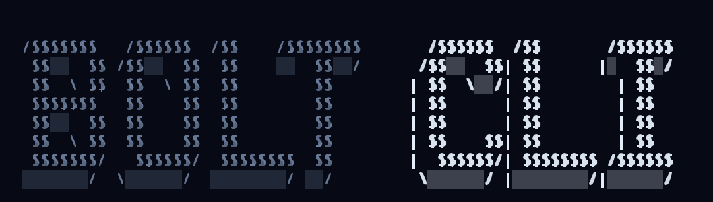

<p align="center">
  <a href="https://github.com/Bolt-builder/bolt-cli">
    
  </a>
</p>

<p align="center">Your AI pair programmer that lives in the terminal.</p>

<p align="center">
  <a href="https://github.com/Bolt-builder/bolt-cli/actions/workflows/publish.yml"></a>
  <a href="https://www.npmjs.com/package/bolt-ai"></a>
  <a href="https://github.com/Bolt-builder/bolt-cli"></a>
  <a href="LICENSE"></a>
</p>

<p align="center">
  <a href="README.md">English</a> |
  <a href="README.zh.md">简体中文</a> |
  <a href="README.zht.md">繁體中文</a> |
  <a href="README.ko.md">한국어</a> |
  <a href="README.de.md">Deutsch</a> |
  <a href="README.es.md">Español</a> |
  <a href="README.fr.md">Français</a> |
  <a href="README.it.md">Italiano</a> |
  <a href="README.da.md">Dansk</a> |
  <a href="README.ja.md">日本語</a> |
  <a href="README.pl.md">Polski</a> |
  <a href="README.ru.md">Русский</a> |
  <a href="README.bs.md">Bosanski</a> |
  <a href="README.ar.md">العربية</a> |
  <a href="README.no.md">Norsk</a> |
  <a href="README.br.md">Português (Brasil)</a> |
  <a href="README.th.md">ไทย</a> |
  <a href="README.tr.md">Türkçe</a> |
  <a href="README.uk.md">Українська</a> |
  <a href="README.bn.md">বাংলা</a> |
  <a href="README.gr.md">Ελληνικά</a> |
  <a href="README.vi.md">Tiếng Việt</a>
</p>

---

## Why Bolt?

Bolt reads your codebase, understands what you're building, and ships code with you: in the terminal, and as a desktop app.

- **Terminal-first.** A fast, keyboard-driven TUI built with [Effect](https://effect.website), [OpenTUI](https://github.com/opentui/opentui), and [SolidJS](https://www.solidjs.com).
- **A whole team of agents.** Ten specialized agents (code, plan, ask, review, debug, refactor, docs, security, migrate, perf) plus subagents for research and multi-step tasks.
- **Sessions you can leave and re-join.** Detach, attach (even to a remote server), fork, share, export, and import your work at any time.
- **Extensible by design.** MCP servers with OAuth, plugins, GitHub integration, and a built-in API server and web UI.
- **Desktop app.** The same engine wrapped in a multi-window desktop experience with tabs, an integrated terminal, and auto-updates.

## Get started in 30 seconds

```bash
# Quick install (macOS / Linux)
curl -fsSL https://raw.githubusercontent.com/Bolt-builder/bolt-cli/install | bash

# Or with npm / bun / pnpm / yarn
npm i -g @bolt-builder/bolt-cli
```

Then, from any project:

```bash
# Open the TUI in the current directory
bolt

# Run a prompt directly (non-interactive)
bolt run "explain this codebase"

# Attach to a running server (local or remote)
bolt attach <url>

# Start a session with a specific agent
bolt run --agent ask "what does this project do?"
```

That's it. Bolt picks up your project context automatically.

## Agents

Built-in agents. Switch with `Tab` in the TUI.

| Agent         | Access | Description                                          |
| ------------- | ------ | ---------------------------------------------------- |
| `code`        | Full   | Default: reads, writes, runs code                    |
| `plan`        | Read   | Explores and produces a plan without changing code   |
| `ask`         | Read   | Questions and research, no file edits                |
| `code-review` | Read   | Reviews changes for correctness, style, and security |
| `debug`       | Full   | Debugs failing tests, crashes, and logic errors      |
| `refactor`    | Full   | Safe refactoring with test verification at each step |
| `docs`        | Edit   | Writes and updates documentation and comments        |
| `security`    | Read   | Security audit: vulnerabilities, secrets, patterns   |
| `migrate`     | Full   | Framework upgrades and dependency migrations         |
| `perf`        | Full   | Performance analysis and optimization                |

Subagents for delegation: `@general` for complex multi-step tasks and `@explore` for fast read-only codebase research. You can also define your own agents as markdown files or generate one with `bolt agent create`.

## Power features

- **Remote sessions**: `bolt attach <url>` and `bolt run --attach <url>` work against any running server, with basic auth and mDNS discovery (`serve --mdns`).
- **Fork and share**: branch a session with `--fork`, share with `run --share`, import straight from a share URL with `bolt import <url>`, export sanitized transcripts with `export --sanitize`.
- **Model control**: pick reasoning effort with `run --variant`, show reasoning with `--thinking`, stream raw events with `--format json`.
- **MCP with OAuth**: `bolt mcp add/auth/logout/debug` manages servers end to end, including OAuth flows and connectivity probes.
- **Minimal mode**: `--mini` gives a compact interactive UI on `bolt`, `run`, and `attach`.
- **Local data, inspectable**: your sessions live in sqlite; query them with `bolt db` any time.

## Desktop app

Bolt also ships as a desktop app: multi-window and multi-tab session management, a prompt composer with attachments and clipboard image paste, an integrated terminal and file tree, a command palette, full settings (keybinds, models, providers, servers), native notifications, deep links, WSL integration on Windows, auto-updates across dev/beta/prod channels, and 17 UI languages. Download it from the [releases page](https://github.com/Bolt-builder/bolt-cli/releases).

> [!NOTE]
> The desktop app is still being rebranded from its OpenCode origins, so current builds ship under the old name and icons. The Bolt identity lands as part of the roadmap below.

## Configuration

Configuration lives in `.bolt/bolt.jsonc` in your project root (created on first run).

```jsonc
{
  "$schema": "https://opencode.ai/config.json",
  "provider": {
    // Provider config goes here
  },
}
```

### Environment variables

| Variable                   | Description                         |
| -------------------------- | ----------------------------------- |
| `OPENCODE_LOG_LEVEL`       | Log level: DEBUG, INFO, WARN, ERROR |
| `OPENCODE_PRINT_LOGS`      | Print logs to stderr                |
| `OPENCODE_PURE`            | Run without external plugins        |
| `OPENCODE_SERVER_PASSWORD` | Basic auth password for the server  |
| `OPENCODE_SERVER_USERNAME` | Basic auth username for the server  |

<details>
<summary><strong>All CLI commands</strong></summary>

| Command      | Description                                              |
| ------------ | -------------------------------------------------------- |
| `bolt`       | Launch the interactive TUI                               |
| `run`        | Run a non-interactive prompt                             |
| `attach`     | Attach the TUI to a running server                       |
| `session`    | Manage sessions (list, delete)                           |
| `agent`      | List and create agents                                   |
| `providers`  | Manage LLM provider credentials (alias: `auth`)          |
| `models`     | List available models                                    |
| `mcp`        | Manage MCP servers (add, list, auth, logout, debug)      |
| `serve`      | Start the headless API server                            |
| `web`        | Start the server and open the web UI                     |
| `upgrade`    | Upgrade to the latest version                            |
| `uninstall`  | Remove bolt                                              |
| `completion` | Generate shell completions                               |
| `export`     | Export session history (with optional `--sanitize`)      |
| `import`     | Import a session from a file or share URL                |
| `plugin`     | Install and manage plugins                               |
| `github`     | GitHub Actions agent (install, run)                      |
| `pr`         | Check out a GitHub PR into a local branch                |
| `stats`      | Show token usage and cost statistics                     |
| `db`         | Query the local session database                         |
| `debug`      | Troubleshooting tools (config, lsp, snapshots, and more) |
| `acp`        | Agent Client Protocol server for editors (e.g. Zed)      |

</details>

## Roadmap

Where Bolt is headed, for the CLI, the desktop app, and everything around them. Have an opinion? [Tell us in Discussions](https://github.com/Bolt-builder/bolt-cli/discussions).

### Now

- [ ] Session sync engine rollout (event-sourced storage, phase 1 shipped)
- [ ] V2 session core (durable runner and coordinator)
- [ ] Project memory module

### Next

<details>
<summary><strong>CLI and sessions (15)</strong></summary>

- [ ] `session tail`: live-follow a running session from another terminal
- [ ] `session search`: full-text search across all transcripts
- [ ] `bolt undo`: one-command rollback of agent changes
- [ ] Named checkpoints and restore points per session
- [ ] `bolt review --staged / --branch`: one-shot AI diff review with exit codes
- [ ] `bolt commit`: AI-generated commit messages from staged changes
- [ ] `bolt doctor`: one-command health check for providers, MCP, and config
- [ ] Budget guards: `--max-cost` and `--max-tokens` on runs
- [ ] Structured output schemas for `run --format json`
- [ ] Session templates: reusable prompt, agent, and model presets
- [ ] Session tags and filters in `session list`
- [ ] `bolt memory`: view and edit what the agent remembers per project
- [ ] Skills management: `bolt skill list/add`
- [ ] Committable permission presets (`.bolt/permissions.jsonc`)
- [ ] Lifecycle hooks: run shell commands before/after tool calls

</details>

<details>
<summary><strong>Agents and intelligence (12)</strong></summary>

- [ ] Best-of-N runs: same task, multiple models, ranked results
- [ ] Shareable agent definitions and an agent gallery
- [ ] Guided custom-agent scaffolding wizard
- [ ] Per-agent model defaults and fallback chains
- [ ] Automatic agent selection based on prompt intent
- [ ] Test-aware refactor loops that verify after each step
- [ ] Repo convention learning: the agent gets better with use
- [ ] Multi-agent pipelines: plan, then code, then review
- [ ] Confidence scoring on agent answers
- [ ] Guardrail agent that blocks risky commands org-wide
- [ ] Prompt caching controls per provider
- [ ] First-class local model presets (Ollama and friends)

</details>

<details>
<summary><strong>Automation and background work (10)</strong></summary>

- [ ] `run --background`: fire-and-forget job queue
- [ ] `bolt jobs list/tail/kill` for background runs
- [ ] Watch mode: rerun tests on change, auto-fix failures
- [ ] Scheduled tasks: `bolt cron` for recurring agent work
- [ ] On-red-main automation: bisect and propose a fix
- [ ] Dependency update automation with a ready-to-review PR
- [ ] Flaky test detection and quarantining
- [ ] Changelog generation on release
- [ ] Auto-triage of new issues
- [ ] Duplicate PR detection

</details>

<details>
<summary><strong>Remote and server (10)</strong></summary>

- [ ] `bolt run --on <host>`: remote execution on a beefier box
- [ ] Team server: a shared agent farm for your org
- [ ] Session handoff between devices
- [ ] Live multiplayer sessions: invite a teammate
- [ ] Control plane graduating out of `/experimental`
- [ ] Workspace placement: route sessions to the right workspace
- [ ] Clustering for V2 sessions
- [ ] TLS and token auth for `serve`
- [ ] Server dashboard: overview of all running sessions
- [ ] mDNS device pairing flow

</details>

<details>
<summary><strong>Desktop app (15)</strong></summary>

- [ ] Complete Bolt rebrand: name, icons, bundle IDs, `bolt://` deep links
- [ ] Tray icon with quick actions
- [ ] Global hotkey to summon the composer from anywhere
- [ ] PR review UI: fetch, comment, and approve from the app
- [ ] Actionable notifications: approve a permission from the notification
- [ ] Session timeline visualization
- [ ] Multi-repo project switcher
- [ ] Drag-and-drop folder onboarding
- [ ] Offline mode with queued prompts
- [ ] Auto-start the daemon on login
- [ ] Windows ARM builds
- [ ] Flatpak and Snap distribution on Linux
- [ ] Menu bar quick model switcher
- [ ] In-app editor for agent and config files
- [ ] Usage and cost dashboard in the app

</details>

<details>
<summary><strong>App and web UI (12)</strong></summary>

- [ ] Web UI feature parity with the desktop app
- [ ] Mobile-friendly session view
- [ ] Theme gallery
- [ ] Split-pane multi-session view
- [ ] Rich markdown export of sessions
- [ ] Inline image and diagram rendering
- [ ] Voice input for the composer
- [ ] Keyboard-first review mode
- [ ] Search across all sessions in the UI
- [ ] Pinned favorite prompts
- [ ] Session sharing links with permissions
- [ ] Live token and cost meter in the composer

</details>

<details>
<summary><strong>MCP and extensibility (10)</strong></summary>

- [ ] MCP registry browser: discover and add servers in one click
- [ ] One-click MCP OAuth flows in the UI
- [ ] Plugin API v2 stable (Effect and Promise flavors)
- [ ] Public server client available to plugins
- [ ] Next-gen SDK replacing the legacy JS SDK
- [ ] CodeMode: script-based tool calling for faster, cheaper runs
- [ ] Theme plugins
- [ ] Custom slash command plugins
- [ ] Plugin sandboxing and permissions
- [ ] Hot-reload plugin development mode

</details>

<details>
<summary><strong>GitHub and integrations (8)</strong></summary>

- [ ] `bolt github automate`: issue-to-PR pipeline
- [ ] Slack delegation: assign a task from Slack, get a PR back
- [ ] Linear and Jira issue intake
- [ ] GitLab support
- [ ] Bitbucket support
- [ ] CI failure auto-fix on PRs
- [ ] PR description generation from a session
- [ ] Automatic responses to review comments

</details>

<details>
<summary><strong>Observability and stats (8)</strong></summary>

- [ ] `stats` export to JSON and CSV
- [ ] Team usage rollups
- [ ] Per-provider latency metrics
- [ ] Shareable session replay recordings
- [ ] OpenTelemetry tracing for agent runs
- [ ] Cost alerts and budgets per org
- [ ] Tool-call analytics: which tools agents use most
- [ ] Startup performance profiling

</details>

### Later

- [ ] Enterprise SSO and SAML
- [ ] Audit logs and compliance controls
- [ ] Role-based access control for team servers
- [ ] Self-hosted enterprise deployment
- [ ] Fine-tuned repo-specific models
- [ ] Agent evaluation benchmark harness
- [ ] Cross-repo and monorepo-wide agents
- [ ] Autonomous long-horizon projects spanning days
- [ ] Agent federation across organizations
- [ ] Plugin and agent marketplace
- [ ] Deep IDE-native extensions (VS Code, JetBrains)
- [ ] Design-to-code: build UIs from Figma files
- [ ] Database-aware agents with safe migrations
- [ ] Integrated security scanning suite
- [ ] On-device small-model routing for trivial tasks
- [ ] Multilingual voice control
- [ ] Pair-programming mode with shared cursor
- [ ] Codebase visualization maps
- [ ] Time-travel debugging across session checkpoints
- [ ] AI release manager: cut, verify, and publish releases end to end

## Contributing

We'd love your help, whether it's a bug fix, a new provider, or better docs. Read the [contributing guide](./CONTRIBUTING.md) to get started, or pick up a [good first issue](https://github.com/Bolt-builder/bolt-cli/issues?q=is%3Aissue+state%3Aopen+label%3A%22good+first+issue%22).

```bash
# Clone and build
git clone https://github.com/Bolt-builder/bolt-cli.git
cd bolt-cli
bun install

# Start the TUI in dev mode (from packages/bolt)
cd packages/bolt
bun dev

# Run tests (from package directories)
bun test

# Type-check
bun typecheck
```

## License

MIT © [Bolt CLI](https://github.com/Bolt-builder/bolt-cli)
