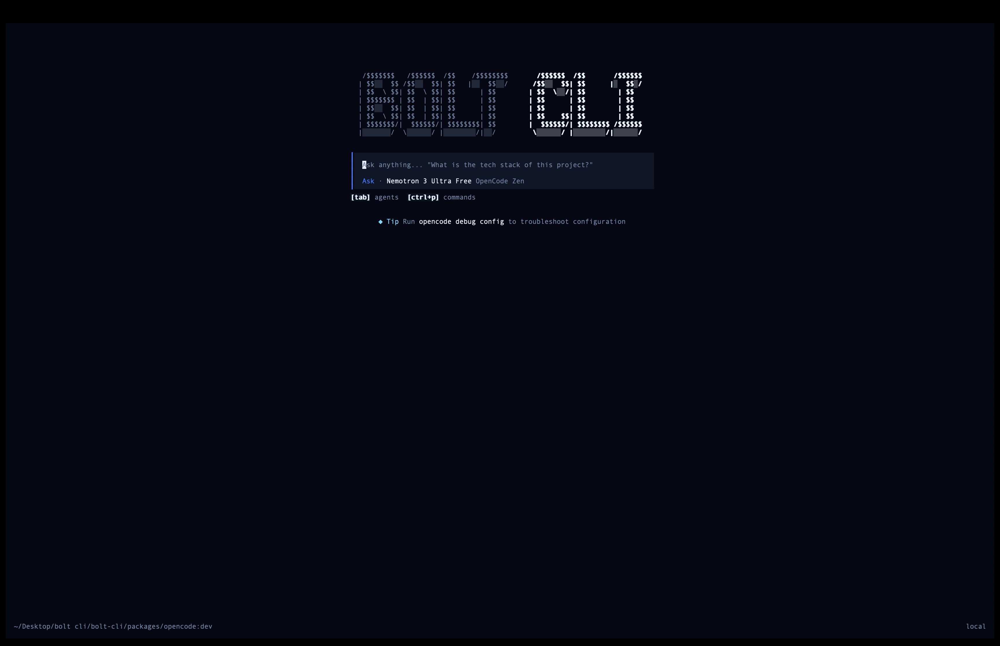

<p align="center">
  <a href="https://github.com/Bolt-builder/bolt-cli">
    <picture>
      <source srcset="images/logo-ornate-dark.svg" media="(prefers-color-scheme: dark)">
      
    </picture>
  </a>
</p>
<p align="center">⚡ The open source AI coding agent — forked from OpenCode.</p>
<p align="center">
  <a href="https://github.com/Bolt-builder/bolt-cli/actions/workflows/publish.yml"></a>
  <a href="https://github.com/Bolt-builder/bolt-cli"></a>
</p>

<p align="center">
  <a href="README.md">English</a> |
  <a href="README.zh.md">简体中文</a> |
  <a href="README.zht.md">繁體中文</a> |
  <a href="README.ko.md">한국어</a> |
  <a href="README.de.md">Deutsch</a> |
  <a href="README.es.md">Español</a> |
  <a href="README.fr.md">Français</a> |
  <a href="README.it.md">Italiano</a> |
  <a href="README.da.md">Dansk</a> |
  <a href="README.ja.md">日本語</a> |
  <a href="README.pl.md">Polski</a> |
  <a href="README.ru.md">Русский</a> |
  <a href="README.bs.md">Bosanski</a> |
  <a href="README.ar.md">العربية</a> |
  <a href="README.no.md">Norsk</a> |
  <a href="README.br.md">Português (Brasil)</a> |
  <a href="README.th.md">ไทย</a> |
  <a href="README.tr.md">Türkçe</a> |
  <a href="README.uk.md">Українська</a> |
  <a href="README.bn.md">বাংলা</a> |
  <a href="README.gr.md">Ελληνικά</a> |
  <a href="README.vi.md">Tiếng Việt</a>
</p>

[](https://github.com/Bolt-builder/bolt-cli)

---

## Bolt CLI

Bolt CLI is a fork of [OpenCode](https://github.com/anomalyco/opencode) — the open source AI coding agent that runs in your terminal. It reads your codebase, understands what you're building, and helps you ship faster.

### Installation

```bash
# Quick install
curl -fsSL https://raw.githubusercontent.com/Bolt-builder/bolt-cli/dev/install | bash

# From npm
npm i -g opencode-ai@latest       # or bun/pnpm/yarn

# From source
git clone https://github.com/Bolt-builder/bolt-cli.git
cd bolt-cli
bun install
bun run build
```

### Desktop App (BETA)

Download directly from the [releases page](https://github.com/Bolt-builder/bolt-cli/releases).

| Platform              | Download                         |
| --------------------- | -------------------------------- |
| macOS (Apple Silicon) | `Bolt-Desktop-mac-arm64.dmg`     |
| macOS (Intel)         | `Bolt-Desktop-mac-x64.dmg`       |
| Windows               | `Bolt-Desktop-windows-x64.exe`   |
| Linux                 | `.deb`, `.rpm`, or `.AppImage`   |

### Agents

Bolt CLI includes built-in agents. Switch between them with `Tab`.

| Agent   | Access  | Description                                          |
| ------- | ------- | ---------------------------------------------------- |
| `code`  | Full    | Default agent for development — reads, writes, runs  |
| `ask`   | Read    | Questions and research — no file edits allowed       |
| `plan`  | Read    | Analysis and exploration — asks before bash commands |

Also included: `general` subagent for complex multistep tasks. Invoke with `@general`.

Learn more about [agents](https://opencode.ai/docs/agents).

### Documentation

For configuration and usage, check out the [OpenCode docs](https://opencode.ai/docs).

### Contributing

Interested in contributing? Read our [contributing guide](./CONTRIBUTING.md) before submitting a PR.

### Credits

Bolt CLI is a community fork of [OpenCode](https://github.com/anomalyco/opencode) by [anomalyco](https://github.com/anomalyco). All credit for the original work goes to the OpenCode team.

---

**Community** [OpenCode Discord](https://discord.gg/opencode) | [X.com](https://x.com/opencode)
